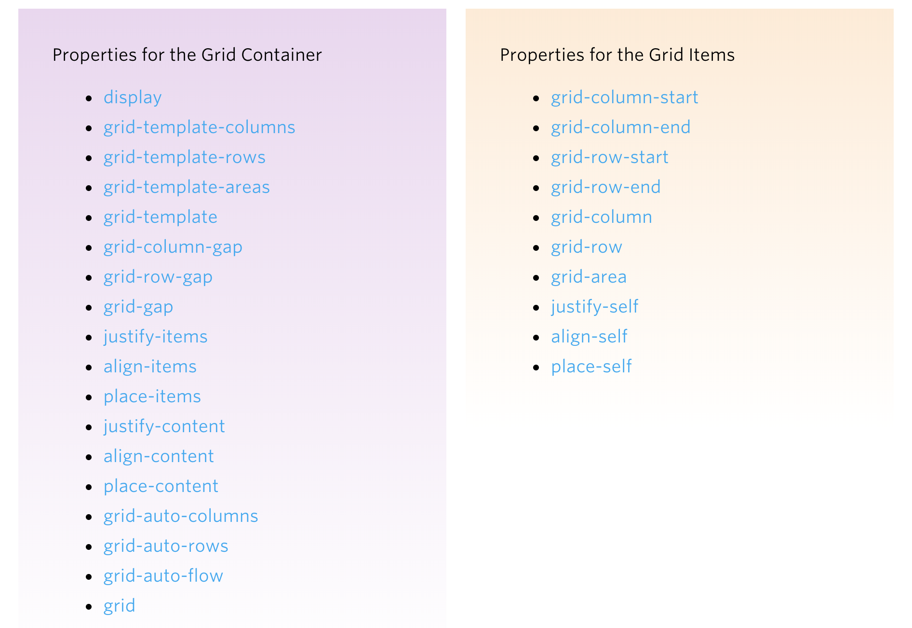

# CSS Avanzado

## Selectores

## Selectores por atributos

A través de estos selectores podemos especificar y dar estilo a elementos que tengan un atributo determinado, o por el valor del mismo.

- **`li[name]`** -> Selecciona todos `li` que tengan al atributo _name_.
- **`li[name="value@]`** -> Selecciona los `li` que tengan el atributo _name_ con el valor _value_.
- **`li[name~="value"]`** -> La virgulilla hace que se seleccionen aquellos elementos cuyos atributos contengas el texto con espacio antes y después del texto.
- **`li[name|="value"]`** -> La barra vertical selecciona los que tengan un atributo que comiencen por el texto indicado y que a continuación tengan un guión `-`.
- **`li[name^="value"]`** -> El circunflejo selecciona aquellos que comienzan por el texto indicado.
- **`li[name$="value"]`** ->  El símbolo dolar selecciona aquellos que finalizan por el texto indicado.

```css
[data-value] {
  /* Attribute exists */
}

[data-value="foo"] {
  /* Attribute has this exact value */
}

[data-value*="foo"] {
  /* Attribute value contains this value somewhere in it */
}

[data-value~="foo"] {
  /* Attribute has this value in a space-separated list somewhere */
}

[data-value^="foo"] {
  /* Attribute value starts with this */
}

[data-value|="foo"] {
  /* Attribute value starts with this in a dash-separated list */
}

[data-value$="foo"] {
  /* Attribute value ends with this */
}
```

## Pseudo-clases

Las pseudo clases son palabras clave que se añaden a los selectores y que especifica un estado especial del elemento seleccionado.

### Pseudo-clases dinámicas

- **`:link`** -> Link sin visitar
- **`:visited`** -> Link visitado
- **`:hover`** -> Ratón por encima del elemento
- **`:active`** -> Elemento activado
- **`:focus`** -> Cuando un objeto tiene foco
- **`:target`** -> Representa un elemento único (el elemento objetivo) con un id que coincide con el fragmento de la URL

### Pseudo-clases UI

- **`:enabled`**
- **`:disabled`**
- **`:checked`**

### Pseudo-clases estructurales

- **`:root`** -> Hace referencia al objeto raíz o HTML.
- **`:nth-child()`** -> Uno o más elementos en función de su posición entre un grupo de hermanos.
  - **:nth-child(an+b)** -> _a_ determina los saltos y _b_ el valor de inicio
  - **`:nth-child(odd)`** or **`:nth-child(even)`**
  - **`:nth-child(-n+3)`** -> Los tres primeros elementos entre un grupo de hermanos.
- **`:nth-last-child()`**
- **`:nth-of-type()`**
- **`:nth-last-of-type()`**
  - **`p:nth-of-type(4n)`** -> Selecciona cada cuatro elementos p, entre cualquier grupo de hermanos.
- **`first-child()`**
- **`last-child`**
- **`:first-of-type`**
- **`last-of-type`**
- **`:only-child`**
- **`:only-of-type`**
- **`:empty`**

### Pseudo-clases negativas

- **`:not(x)`**

### Pseudo-elementos

Seleccionan elementos que normalmente no se pueden acceder

- **`::first-line`**
- **`::first-letter`**
- **`::before`**
- **`::after`**

### Selectores de combinaciones

- **`A > B`** -> Cualquier elemento seleccionado por B e hijo directo de A.
- **`A + B`** -> Cualquier elemento selecconado por B y es el siguiente hermano de un elemento seleccionado por A (es decir, el siguiente hijo del mismo padre).
- **`A ~ B`** -> Uno de los siguientes hermanos del elemento seleccionado por A que sea eleccionado por B.

---

## Modos de estructuración de páginas web

### Flexbox

#### Propiedades del padre (flex container)

##### Display y flex-direction

```css
.container {
  display: flex | inline-flex;
  flex-direction: row | row-reverse | column | column-reverse;
}
```

##### Flex-wrap

```css
.container {
  flex-wrap: nowrap | wrap | wrap-reverse;
}
```

- **Nowrap:** Todos los hijos estarán en la misma línea.
- **Wrap:** Los hijos se dividirán en múltiples líneas, de arriba a abajo.
- **Wrap-reverse:** Igual pero de abajo a arriba.

##### Flex-flow

```css
.container {
  flex-flow: <'flex-direction'> || <'flex-wrap'>;
}
```

##### Justify-content

Define el alineamiento frente al eje principal.

```css
.container {
  justify-content: flex-start | flex-end | center | space-around | space-between, space-evenly;
}
```

##### Align-items

Define el alineamiento frente al eje secundario

```css
.container {
  align-items: flex-start | flex-end | center | stretch | baseline;
}
```

_Baseline:_ Los textos de cada hijo se alinean.

##### Align-content

Alinea las lineas del contenedor cuando hay espacio extra en el eje secundario. Similar a `justify-content` en que alinea hijos individuales con el eje principal.  
No tiene efecto cuando hay solo una linea de objetos hijos.

```css
.container {
  align-content: flex-start | flex-end | center | space-between | space-around | stretch;
}
```

#### Propiedades del hijo (flex items)

##### Order

```css
.item {
  order: <integer>; /* default is 0 */
}
```

##### Flex-grow y flex-shrink

Define la capacidad de un item hijo de crecer si es necesatio. Dicta el espacio disponible dentro del padre que debe ocupar.  
Si todos los hijos tienen `flex-grow: 1`, el espacio restante se repartirá entre todos los hijos.

```css
.item1 {
  flex-grow: <number>; /* defualt is 0 */
}

.item2 {
  flex-shrink: <number>; /* defualt is 1*/
}
```

##### Flex-basis

Define el tamaño por defecto de un elemento antes de que el espacio sobrante sea repartido. 
La palabra `auto` significa _mira a mi `height` o `width`_.
La palabra `content` significa que depende del contenido del hijo (texto).

```css
.item {
  flex-basis: <length> | auto;
}
```

##### Flex

Atajo para `flex-grow`, `flex-shrink` _opt_ y `flex-basis` _opt_. Con valores por defecto **0 1 auto**.

```css
.item {
  flex: none | [ <'flex-grow'> <'flex-shrink'>? || <'flex-basis' ];
}
```

##### Align-self

```css
.item {
  align-self: auto | flex-start | flex-end | center | baseline | stretch;
}
```

#### CSS Grid

