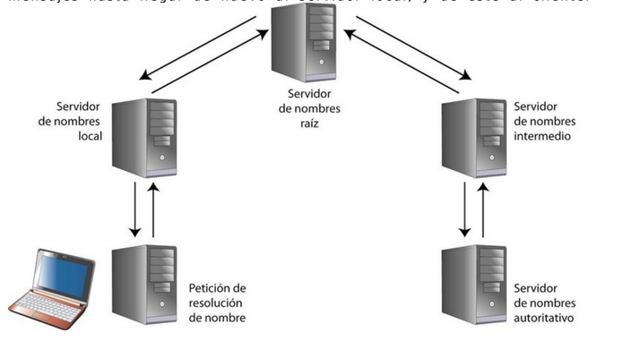

# 02.01. Servicio DNS

## Introducción

**DNS (Domain Name System):** O sistema de nombres de dominio. Consiste en una jerarquía de nombres de cualquier recurso conectado a Internet (o red privada), como puede ser un servidor web; que relacionan los nombres de dominio de cada participante en la red con información de diversa ídnole que permite localizar y direccionar estos equipos a cualquier nivel.

Tres componentes:

- **Cliente DNS:** Se ejecuta en el ordenador del usuario y, como cliente, lo que hace es realizar solicitudes al servidor DNS para que resuelva nombres.
  No es un programa cliente en sí, sino una librería del sistema oprativo a la que solicitamos una traducción de nombres y se encarga de solicitársela al servidor de DNS.
- **Servidor DNS:** Resuelve la petición del cliente DNS y le envían la respuesta. Existen varios tipios pero los más comunes son los _recursivos_.
- **Zonas de autoridad:** Es una parte del sistema de nombres de dominios sobre la que es responsable un servidor DNS/. Su función más importante es "traducir" nombres inteligibles para las personas en identificadores binarios asociados con los equiopos conectados a la red, con el objeto de localizar y direccionar estos equipos a nivel mundial.

---

## Funcionamiento

**Función de servidores DNS:** Resolver la petición que hace un usuario a un nombre de deominio y transformarla en una dirección IP que corresponde con el servidor web en donde se hospeda la página web.

### Espacio de nombres DNS

El DNS usa el concepto de `espacio de nombres distribuido`.  
Los nombres simbólicos se agrupan en **zonas de autoridad** o **zonas**.  
En cada una de estas _zonas_, uno o más hosts tienen la tarea de mantener una **base de datos** con los nombres simbólicos y direcciones IP; y de _hacer de servidor_ para los clientes que quieren traducir nombres a direcciones IP.

Estos servidores de nombres locales se interconectan lógicamente en un árbol jerárquico de dominios.
Cada zona contiene una _parte del árbol_ o subárbol y los nombres de esa zona se administran con independencia de los de otras zonas.

### Usos del DNS

El DNS tiene varios objetivos. Los más comunes son:

- **Resolución de nombres:** Dado el nombre de un host, obtener su dirección IP.
- **Resolución inversa de nombres:** Mecanismo inverso al anterior, dada una dirección IP obtener el nobmre asociado a la misma.
- **Resolución de servidores de correo:** Dado un nombre de dominio (como gmail.com), obtener el servidor a través del cual debe realizarse la entrega de correo electrónico (en ese caso, gmail-smtp-in.l.google.com).

Es utilizado también para otras muchas cosas, como la obtención de claves públicas de cifrado asimétrico y la validación de envío de e-mails.

## Terminología básica

- **Host Name:** El nombre de un host es una sola "palabra" (formada por letras, números y guioones). _Como por ejemplo, "www", "blog", etc_.
- **Fully Qualified Host Name (FQHN)** o **Fully Qualified Domain Name (FQDN):** Es el "nombre completo" de un host. Está formado por el hostname, seguido de un punto y su correspondiente nombre de dominio.
- **Domain Name:** El nombre del dominio es una sucesión de nombres concatenados por puntos. _Algunos ejemplos son "smaldone.com.es", "com.es" y "es"._
- **Top Level Domains (TLD):** Los dominios de nivel superior son aquellos que no pertenecen a otro dominio. _Como por ejmplo, "com", "org", "net" y "es"._

## Arquitectura del DNS

El sistema DNS funciona en base al protocolo **UDP**. Las peticiones se realizan a través del puerto 53.

El sistema está estructurado en forma de árbol. Cada nodo del árbol está compuesto por un `grupo de servidores que se encargan de resolver un conjunto de dominios` _(zonas de autoridad)_.  
Un **subdominio** puede verse como una especialización de un dominio de nivel anterior. _Por ejemplo, "smaldone.com.es" es un subdominio de "com.es", que a su vez lo es del TLD "es"_.

- **Root servers** o **Servidores raíz:** Son los servidores con autoridad sobre los TLD. Son fijos -ya que rara vez cambian-, y son 13.

## Métodos de resolución

### Resolución iterativa

El servidor DNS local devuelve la mejor respuesta que puede ofrecer al cliente en función del contenido de su caché; pero si el servidor no dispone de la información solicitada, indica la IP del siguiente servidor de nombres autorizado a preguntar, comenzando siempre por un servidor Raíz.

PROCESO:  
Cuando una aplicación (cliente) necesita resolver un FQDN envía un requerimiento al servidor de nombres configurado en el sistema (normalmente, el provisto por el ISP).  
A partir de entonces se desencadena el proceso de resolución del nombre:

1. El servidor de nombres inicial (el de la red local o el de nuestro proveedor de Internet) consulta a uno de los servidores raíz (cuya dirección IP debe conocer previamente).
2. Este devuelve el nombre del servidor a quien se le ha delegado la sub-zona.
3. El servidor inicial interrroga al nuevo servidor.
4. El proceso se repote nuevamente a partir de **( 2. )**  si es que se trata de una sub-zona delegada.
5. Al obtener el nombre del servidor con autoridad sobre la zona en cuestión, el servidor inicial lo interroga.
6. El servidor resuelve el nombre correspondiente, si este existe.

### Resolución recursiva

Se realiza una petición de resolución de nombres al servidor local; y si el servidor no dispone de la información solicitada, consulta al servidor raíz que menos tarde en ofrecer respuesta.
El servidor raíz consultará al intermedio, y así sucesivamente hasta llegar hasta el autorizado. Una vez el autorizado responde al nivel anterior (con acierto o error), se van devolviendo los mensajes hasta llegar de nuevo al servidor local, y de este al cliente

## Mecanismos de caché

Cada vez que un servidoir de nombres envía una respuesta, lo hace adjuntando el _tiempo de validez de la misma_ (**TTL** o **tiempo de vida**).  
Esto posibilita que el receptor, antes de la necesidad de volver a resolver la misma consulta, pueda utilizar la información previamente obtenida en vez de realizar un nuevo requerimiento.  
Esta es la razón por la cual los cambios realizados en el DNS no se propagan instantáneamente a través del sistema. Dependiendo de la naturaleza de los mismos (y de la configuración de cada servidor), la propagación puede tardar desde algunos minutos hasta variso días.

## Correo electrónico y resolución de nombres

Normalmente los usuarios de correo electrónico redactan sus mensajes usando un cliente de correo y enviándolo a través de un servidor SMTP provisto por su ISP o a través de un sistema de correo vía web (webmail). En cualquier caso, una vez que el mensaje es recibido por el servidor, debe ser entregado al destinatario. Aquí interviene el sistema DNS:

1. El servidor del emisor solicita al DNS (de acuerdo al mecanismo analizado anteriormente), la entrada MX del dominio del receptor del mensaje. MX significa _"mail exchanger"_, esto es, el nombre del servidor (o los servidores) encargado de recibir los mensajes destinados a determinado dominio.
2. El DNS devuelve el FQHN y la dirección IP delm mail exchanger.
3. El servidor del emisor se conecta al puerto 25 mediante TCP, del servidor del destinatario y entrega el mensaje según el protocolo SMTP.
4. El proceso podrá continuar si el servidor receptor del mensaje no es el último de la cadena. Existen servidores que actúan como "puertas de enlace" o "getagays" de correo electrónico, y que se encargan de recibir los mensajes de determinados dominios para luego enviarlos a otros servidores.

## Tipos de registro en un servidor de nombres

Un servidor de nombres puede almacenar distinta información.  
En cada zona de autoridad, existirán entradas de distinto tipo, como puedn ser:

- **A (Address):** Para traducir nombres de hosts del dominio en cuestión a direcciones IP.
- **CNAME (Canonical Name):** Es un alias para un host determinado. _No define una dirección IP sino un nuevo nombre._
- **NS (Name Server):** Especifica el servidor (o servidores) de nombres para un dominio.
- **MX (Mail Exchange):** Define el servidor encargado de recibir el correo electrónico para el dominio.
- **PTR (Pointer):** Especifica un "registro inverso", a la inversa del registro A, permitiendo la traducción de direcciones IP a nombres.
- **TXT (Text):** Permite asociar información adicional a un dominio, como claves de cigrado _"DomainKeys"_ o _"Sender Policy Framework"_.

### Bind, el servidor de nombres

**BIND (Berkely Internet Name Domain)** es el único software utilizado en los servidores de nombres de Internet.  
Este programa de licencia liber es utilizado prácticamente en todos los sistemas Unix del mundo.

Esto ha sido considerado un problema de seguridad, al punto que se ha propuesto la migración de algunos _root servers_ a otro sistema, ya que si apareciese algún problema de seguridad podría implicar la caída de todo el DNS de Internet.

---

## Uso del DNS en una red local

Ya en redes de tamaño medio (más de 5 equipos) es conveniente la utilización del DNS.  
Esto no tiene nada que ver con el DNS de Internet (aunque el servidor local pueda estar vinculado a este sistema).

Es conveniente montar un servidor local de DNS por los siguientes motivos:

- **Agilizar el acceso a Internet:**  
  Al tener un servidor de nombres en nuestra propia red local (que acceda al DNS de nuestro proveedor o directamente a los root servers), se agiliza el mecanismo de resolución de nombres, manteniendo  en caché los nombres recientemente usados en la red y disminuyendo el tráfico hacia/desde Internet.
- **Simplificar la administración de la red local:**  
  Al contar con un DNS propio (ya sea uno o varios servidores de nombres) es posible definir zonas locales (no válidas ni accesibles desde Internet) para asignar nombres a cada uno de los hosts de la LAN. De esta forma es posible, por ejemplo, referirnos a la impresora de red como "hplaser.mired.local" en vez de "192.168.0.2" y a nuestro servidor de correo interno como "smtp.mired.local" en vez de "192.168.0.3". (Pensemos, por ejemplo, que ocurriría con las configuraciones de las aplicaciones si un día decidimos cambiar el esquema de direcciones IP de nuestra red.).

## Problemas del DNS

El principal problema que presenta el DNS es que, al estar basado en UDP (protocolo de transporte que no garantiza la recepción de la información enviada), **tanto las consultas como las respuestas pueden "perderse"** (por ejemplo, a causa del congestionamiento en algún enlace de la red).

Es común apreciar cómo, en el caso de servidores y redes no muy bien configuradas, la resolución de nombres se resiente sensiblemente ante cualquier anomalía (saturación de tráfico o del servidor de nombres local).

Otro inconveniente, que ya hemos hecho notar, es la lentitud de la propagación de las modificaciones en el sistema, producto de la propia arquitectura del mismo.

Aún así, el mayor problema es la pésima configuración de los servidores de muchos ISP. Una buena solución es ejecutar un servidor de nombres en algún equipo de la red local, de forma que se comunique directamente con los _root servers_ (evitando de esta forma pasar a través de los servidores de nombres de nuestro proveedor).