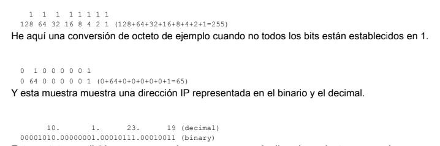

# 2. Direccionamiento y Subredes

## Antes de empezar

Reapasar binario y números decimales, si hiciese falta.

## Conceptos

**Direccionamiento:** Número único ID asignado a una host o interfaz en una red.

**Subred:** Porción de una red que comparte a una dirección de subred determinada.

**Máscara de subred:** Combinación de 32 bits usada para describir que la porción de un direccionamiento se refiere a la subred y la otra porción se refiere al host.

**Interfaz:** Conexión de red.

## Direcciones IP

Una dirección IP es un direccionamiento usado para identificar únicamente un dispositiovo en una red del IP. Se compone de 32 bits binarios, que pueden ser divisibles en una porción de la red y recibir la porción con la ayuda de una máscara de subred. Los 32 bits binarios se dividen en cuatro octetos (1 octeto = 8 bits). Cada octeto se convierte a decimal y se separa con un punto. Por ello se dice que una dirección IP se expresa en formato decimal con puntos _(tal que 172.16.81.100)_. El valor en cada octeto posee un rango decimal de 0 a 255 o binario de 00000000 a 11111111.

### Convertir octetos de binario a decimal

El bit más a la derecha o menos significativo -de un octeto- lleva el valor de 20.  
El siguiente a este, lleva un valor de 21.  
Esto continúa hasta el bit más a la izquierda, o más significativo., que lleva un valor de 27.  
Por ende, si todos los bits son un uno, el equivalente decimal sería 255.

Estos octetos se dividen para proporcionar un esquema de direccionamiento que puede adaptarse a redes pequeñas y grandes. Hay cinco clases diferentes de redes: _de la A a la E_. Este documento se centra en las clases A al c, puesto que la D y E son reservadas.

_**Nota:** Los términos clase A y clase B están utilizados en este documento para ayudar a facilitar la comprensión del IP Addressing y subnetting. Estos términos apenas se utilizan ya en la industria, debido a la introducción de **Classless Interdomain Routing o CIDR**_.