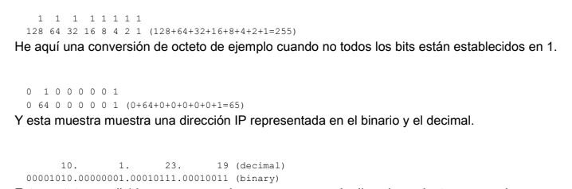
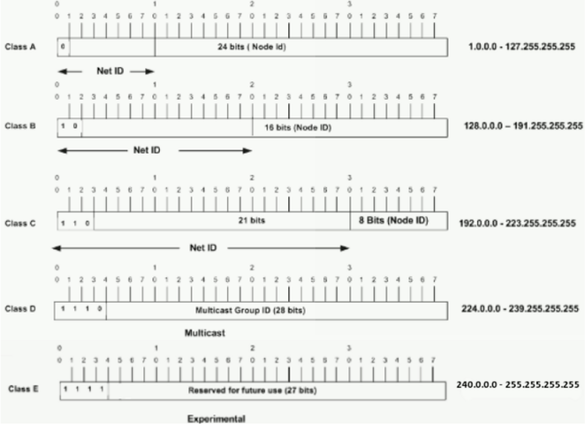
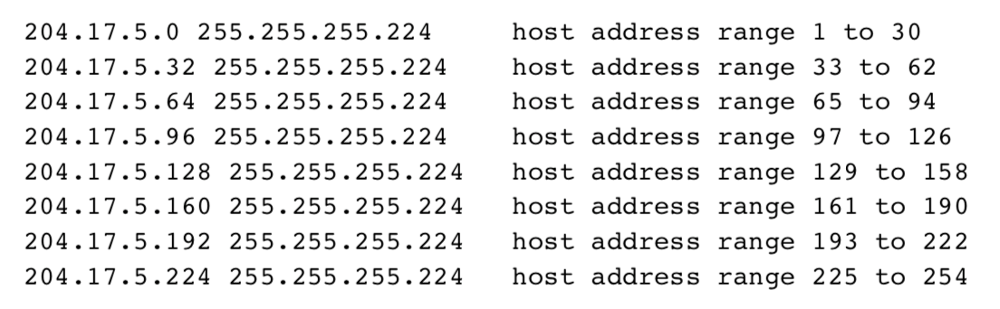
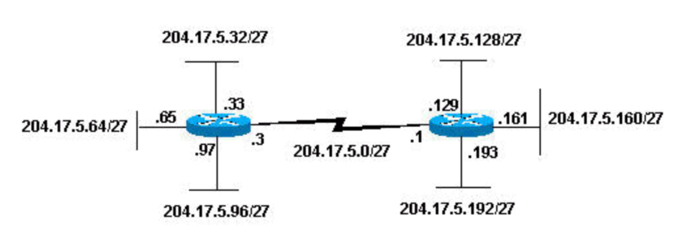

# 2. Direccionamiento y Subredes

## Antes de empezar

Repasar binario y números decimales, si hiciese falta.

## Conceptos

**Direccionamiento:** Número único ID asignado a una host o interfaz en una red.

**Subred:** Porción de una red que comparte a una dirección de subred determinada.

**Máscara de subred:** Combinación de 32 bits usada para describir que la porción de un direccionamiento se refiere a la subred y la otra porción se refiere al host.

**Interfaz:** Conexión de red.

## Direcciones IP

Una dirección IP es un `direccionamiento usado para identificar únicamente un dispositivo en una red del IP`. Se compone de `32 bits binarios, que pueden ser divisibles en una porción de la red y recibir la porción con la ayuda de una máscara de subred`. Los 32 bits binarios se dividen en cuatro octetos (1 octeto = 8 bits). Cada octeto se convierte a decimal y se separa con un punto. Por ello se dice que una dirección IP se expresa en formato decimal con puntos _(tal que 172.16.81.100)_. El valor en cada octeto posee un rango decimal de 0 a 255 o binario de 00000000 a 11111111.

### Convertir octetos de binario a decimal

El bit más a la derecha o menos significativo -de un octeto- lleva el valor de 2<sup>0</sup>.  
El siguiente a este, lleva un valor de 2<sup>1</sup>.  
Esto continúa hasta el bit más a la izquierda, o más significativo., que lleva un valor de 2<sup>7</sup>.  
Por ende, si todos los bits son un uno, el equivalente decimal sería 255.



Estos octetos se dividen para proporcionar un esquema de direccionamiento que puede adaptarse a redes pequeñas y grandes. Hay cinco clases diferentes de redes: _de la A a la E_. Este documento se centra en las clases A al c, puesto que la D y E son reservadas.

_**Nota:** Los términos clase A y clase B están utilizados en este documento para ayudar a facilitar la comprensión del IP Addressing y subnetting. Estos términos apenas se utilizan ya en la industria, debido a la introducción de **Classless Interdomain Routing o CIDR**_.

Se puede determinar la clase de IP, viendo los tres bits de orden más alto (los tres bits más a la izquierda en el primer octeto).

La siguiente imagen muestra la significación de los tres bits de orden superior y el rango de direcciones que caen en cada clase.



**Dirección de Clase A:** El primer octeto es la parte de la red. Por ejemplo, en el primer ejemplo de la imagen anterior, el de la clase A, tiene una dirección de red principal de 1.0.0.0 - 127.255.255.255. Los octetos 2, 3 y 4 (es decir, los 24 bits siguientes) son para que el administrador de la red divida en _subredes_ y _hosts_ como estime conveniente. Las direcciones de clase A se usan para redes que tienen más de 65536 hosts.

**Dirección de Clase B:** Los dos primeros octetos son la parte de la red, por lo que en el ejemplo de Clase B, la dirección de red principal es 128.0.0.0 - 191.255.255.255. Los octetos 3 y 4 (16bits) se dedican en este caso para subredes locales y hosts.

**Dirección de Clase C:** Los tres primeros octetos son la parte de la red. El ejemplo de la Clase C tiene una dirección de red principal de 192.0.0.0 - 223.255.255.255. El octeto 4 (8 bits) es para subredes y hosts.

## Máscaras de red

La **máscara de red** `ayuda a saber qué parte de la dirección identifica la red y qué parte de la dirección identifica el nodo`. Las redes de la clase A, B y C tienen máscaras predeterminadas, también conocidas como máscaras naturales, como se muestra aquí:

```terminal
Clase A: 255.0.0.0
Clase B: 255.255.0.0
Clase C: 255.255.255.0
```

Una dirección IP de una red de la Clase A que no se haya convertido en subred tendrá un par dirección / máscara similar a : 8.20.15.1 / 255.0.0.0. Para ver cómo la máscara le ayuda a identificar a las partes de la red y del nodo el direccionamiento, convierta el direccionamiento y la máscara a los números binarios.

```terminal
8.20.15.1 = 00001000.00010100.00001111.00000001
255.0.0.0 = 11111111.00000000.00000000.00000000
            -----------------------------------
             net id |      host id

netid =  00001000 = 8
hostid = 00010100.00001111.00000001 = 20.15.1
```

## Subnetting

La conexión en subredes permite crear múltiples redes lógicas que existen dentro de una red única Clase A, B o C. Si no crearamos una subred, solamente podremos utilizar una red de la red de Clase A, b o C, lo que es poco realista.

Cada link de datos de una red debe tener una identificación de red única, siendo cada nodo de ese link miembro de la misma red. Si divide una red principal (clase A, B o C) en subredes menores, podrá crear una red de subredes interconectadas. Cada link de datos de esta red tendrá entonces una identificación única de red/subred.

Dada una red clase C de 204.17.5.0 que tenga una máscara natural de 255.255.255.0, usted puede crear las subredes de este modo:

```terminal
204.17.5.0 -      11001100.00010001.00000101.00000000
255.255.255.224 - 11111111.11111111.11111111.111000000
                  --------------------------|sub|-----
```

Extendiendo la máscara para que sea 255.255.255.224, ha tomado tres bits (indicados por "sub") de la parte original del host de la dirección y los ha utilizado para crear subredes. Con estos tres bits, es posible crear ocho subredes.  
Con los cinco bits de ID de host restantes, cada subred puede tener hasta 32 direcciones de host, 30 de las cuales pueden asignarse realmente a un dispositivo ya que **las ID del host con todos ceros o todos unos no están permitidas**. Por consiguiente, se han creado las siguientes subredes:



_Nota:_ Hay dos maneras de denotar estas máscaras. Primero, puesto que se utiliza tres bits más que la máscara "natural" del C de la clase, podemos denotas estos direccionamientos como **tener una máscara de subred de 3 bits**.  
Otra forma es que la máscara de 255.255.255.224 **también se puede indicar como /27 ya que hay 27 bits establecidos en la máscara**. Este segundo método se utiliza como CIDR. Con este método, una de estas redes se puede describir con el prefijo/la longitud de la notación.
Por ejemplo, 204.17.5.32/27 denota la red 204.17.5.32 255.255.255.224. Cuando es apropiado, el prefijo/la notación de la longitud se utilizapara denotar la máscara en el resto de este documento.

El siguiente esquema de subredes de la red permite ocho subredes, y podría aparecer como:

]

Cada uno de estos routers está asociado a cuatro subredes, una subred es común a ambos routers.
Además, cada router tiene una dirección IP para cada subred a la que está asociada. Cada subred podría dar soporte hasta a 30 direcciones de host.
