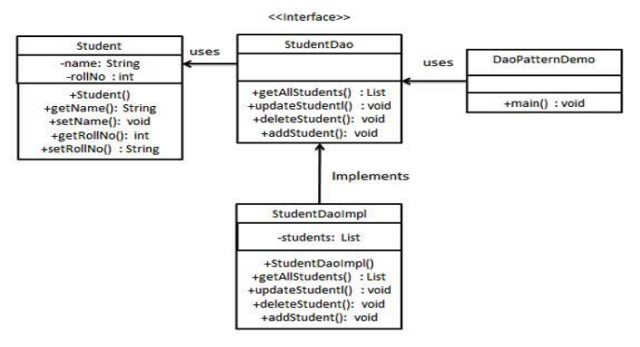

# Patrón DAO

## 1. Introducción

**DAO (Data Access Object)**: Define servicios de acceso a datos simple4s, de alto nivel, aislando la complejidad de la lógica del API de bajo nivel utilizado para acceder a la BD.

Identificamos tres participantes:

- DAO Interface: Interfaz que define las operaciones que se van a realizar sobre el modelo de objetos.
- DAO Implements: Clase que implementa la interfaz anterior. Responsable de obtener los datos del origen de datos (BD, archivo XML...).
- Model: Clase POJO *(Plain Old Java Object)* que se usa para almacenar los datos que se intercambian con el origen de datos.

_**POJO**: Objeto simple con propiedades y métodos getter y setter._

En este caso:
| Interface  | DAOImpl | Model |
|------------|---------|-------|
| StudentDAO | StudentDAOImpl | |



---

```java
// Student.java     - Model
public class Student {
    private String name;
    private int rollNo;
    Student(String name, int rollNo){
        this.name = name;
        this.rollNo = rollNo;
    }
    public String getName() {
        return name;
    }
    public void setName(String name) {
        this.name = name;
    }
    public int getRollNo() {
        return rollNo;
    }
    public void setRollNo(int rollNo) {
        this.rollNo = rollNo;
    }
}
```

```java
// StudentDao.java
import java.util.List;

public interface StudentDao {
    public List<Student> getAllStudents();
    public Student getStudent(int rollNo);
    public void updateStudent(Student student);
    public void deleteStudent(Student student);
}
```

```java
// StudentDaoImpl.java
import java.util.ArrayList;
import java.util.List;

public class StudentDaoImpl implements StudentDao {

    //list is working as a database
    List<Student> students;
    public StudentDaoImpl(){
        students = new ArrayList<Student>();
        Student student1 = new Student("Robert",0);
        Student student2 = new Student("John",1);
        students.add(student1);
        students.add(student2);
    }

    @Override
    public void deleteStudent(Student student) {
        students.remove(student.getRollNo());
        System.out.println("Student: Roll No " + student.getRollNo() + ", deleted from
        database");
    }

    //retrive list of students from the database
    @Override
    public List<Student> getAllStudents() {
        return students;
    }

    @Override
    public Student getStudent(int rollNo) {
        return students.get(rollNo);
    }

    @Override
    public void updateStudent(Student student) {
        students.get(student.getRollNo()).setName(student.getName());
        System.out.println("Student: Roll No " + student.getRollNo() + ", updated in the
        database");
    }
}
```

```java
// DaoPatternDemo.java
public class DaoPatternDemo {
    public static void main(String[] args) {
        StudentDao studentDao = new StudentDaoImpl();

        //print all students
        for (Student student : studentDao.getAllStudents()) {
            System.out.println("Student: [RollNo : " + student.getRollNo() + ", Name : " +
            student.getName() + " ]");
        }

        //update student
        Student student =studentDao.getAllStudents().get(0);
        student.setName("Michael");
        studentDao.updateStudent(student);

        //get the student
        studentDao.getStudent(0);
        System.out.println("Student: [RollNo : " + student.getRollNo() + ", Name : " +
        student.getName() + " ]");
    }
}
```