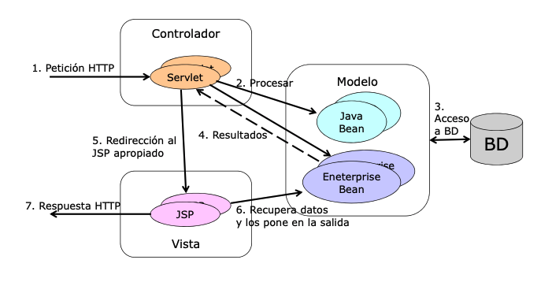

# MVC (Modelo Vista Controlador)

## Arquitectura MVC en Java EE



En el MVC:

- Los Beans representan los datos, y son usados para la lógica del negocio.
- Los servlets gestionan las peticiones de los clientes
- Estos reenvían la petición a una página JSP.
- La página JSP accede a los Beans para consultar los resultados.

## Servlets - Reenvío de peticiones

El servlet determina la página JSP apropiada y a través del `RequestDispatcher` le da el control.

```java
public void doGet(HttpServletRequest request, HttpServletResponse response) throws Servlet Exception, IOException {
    // ...
    RequestDispatcher dispatcher = request.getRequestDispatcher(jsp);
dispatcher.forward(request, response);
}

```

## Paso de Beans

Por tres lugares:

### HttpServletRequest
  
Visibles para el servlet y la página o servlet a la que se lo reenvía.

```java
// En el servlet:
UnBean valor = LookupService.findResult(...);
request.setAttribute("clave", valor);

// En la página JSP:
${clave.propiedad}
```

### HttpSession

Visibles para el servlet, la pag o servlet, y otraas pagians posteriores referentes al mismo usuario.

```java
// En el servlet:
session.setAttribute("clave", valor);
```

### ServletContext

Visibles para todos los servlets y páginas de la aplicación

```java
// En el servlet:
getServletContext().setAttribute("clave", valor);
```